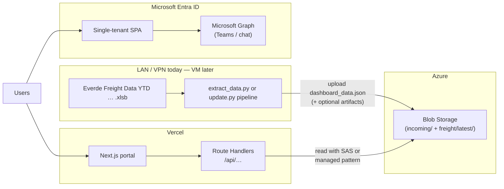

# Everde AI Operations — hosted launch plan

This document is the working plan for moving the portal from **localhost + UNC share** to **Vercel (UI) + Azure Blob (data) + Entra ID (auth)** while keeping **weekly freight `.xlsb` drops** and **Teams (Microsoft Graph)** working. It aligns with Phase A for a **smooth testing launch**, then scales to a **dedicated VM runner** without redesign.

---

## 1. Architecture (target)

**Principles**

| Principle | Implication |
|-----------|-------------|
| **Vercel cannot see `\\192.168.190.10\…`** | All production data the app reads must be in **Blob** (or HTTPS APIs), not UNC paths. |
| **Excel / `.xlsb` parsing is heavy** | **Python runs on your machine now** (later on a VM), not inside a default Vercel serverless function. |
| **Single source for “live” dashboard numbers** | Prefer **`dashboard_data.json`** (or versioned blobs) produced by Python from **backend tabs**, per `scripts/freight/FREIGHT_DASHBOARD_DATA.md` — not formula recalc in Excel via LibreOffice. |
| **Git = source only** | Do not commit `.xlsb` or large JSON; Blob holds binaries and published artifacts. |

---

## 2. Component decisions (locked for this launch)

| Area | Choice | Notes |
|------|--------|--------|
| **UI hosting** | **Vercel** | Matches current Next.js 15 app; env vars for Entra + Azure. |
| **Artifact storage** | **Azure Blob** | You stay in control without AWS Oracle DBA tickets. Containers e.g. `incoming`, `freight`, `metadata`. |
| **Identity** | **Entra single-tenant SPA** | Restricts sign-in to your directory; add **claim checks** (`tid`, `email`/`upn` @everde.com) on sensitive routes. |
| **Teams / Communications** | **Microsoft Graph (delegated)** | App already targets scopes like `User.Read`, `Chat.ReadWrite`, `Chat.Create`, `People.Read` (`TeamsIntegrationPanel.tsx`). **Admin consent** in tenant required for production. |
| **Runner (extract / pipeline)** | **Your PC now → dedicated VM later** | Same VPN/share access as today; later swap machine, keep Blob contract. |
| **Claude handoff** | **`extract_data.py`** (or consolidated pipeline) | Input: path to weekly `.xlsb`. Output: `dashboard_data.json`. Optional: keep emitting static HTML until the UI loads purely from JSON. |

---

## 3. Blob layout (suggested)

| Path | Purpose |
|------|---------|
| `incoming/{yyyy-mm-dd}/{original-filename}.xlsb` | Raw drops (from **Admin upload** or runner copy from share). |
| `freight/latest/dashboard_data.json` | **Current** payload the portal reads (overwrite or swap pointer after successful run). |
| `freight/history/{timestamp}/dashboard_data.json` | Rollback / audit. |
| `freight/latest/manifest.json` | Optional: sha256, source file name, processed UTC, schema version. |

Runner policy: **never** publish `latest` until Python completes successfully.

---

## 4. Processing flow

### A. Automated path (share drop — primary long-term)

1. File lands on `\\192.168.190.10\Claude Sandbox\DataDrops\Freight\` (or agreed inbox).
2. **Runner** (local script scheduled or manual): detects new file → runs **`extract_data.py`** (or `update.py` stack) → writes **`dashboard_data.json`** → uploads to **`freight/latest/`** (+ history).

### B. Admin manual upload (portal)

1. Authenticated **Admin** users open **`/admin`** (top-right entry).
2. **Next route** receives `multipart/form-data`, validates type/size, streams file to **`incoming/...`** in Blob (using **Azure SDK** on the server with **storage connection string** or **SAS-limited write** in Vercel env — never expose secrets to the browser).
3. **Processing** (important): Vercel **does not** run your Python. After upload, either:
   - **Testing launch:** show message *“File stored — run local processor”* and document a one-command runner that pulls from `incoming` or processes a known path; **or**
   - **Next iteration:** trigger **Azure Function** / **Container Apps Job** / **VM webhook** that runs Python and updates `freight/latest`.

For Phase A, **upload-to-Blob + local processing** is honest and shippable; promise “one-click process” only after a small Azure compute step or VM job exists.

---

## 5. Portal application changes (ordered backlog)

Rough order for **testing launch**:

1. **Git remote + Vercel project**  
   - Connect GitHub repo, production branch, env vars.

2. **Entra production app**  
   - Single-tenant, redirect: `https://<prod-domain>/auth/msal-bridge`, localhost for dev.  
   - Admin consent for Graph scopes used by Communications.

3. **Middleware: protect routes**  
   - Require session / MSAL account for portal routes; optional **`@everde.com`** check on server for API routes serving freight JSON.

4. **Read `dashboard_data.json` from Blob** — **`GET /api/freight/dashboard-data`** (implemented; falls back to `public/dashboard_data.json`).  

5. **Freight UI**  
   - **Short term:** keep iframe HTML embed **or** switch shell to fetch JSON and hydrate (Claude’s `fetch` approach — can follow after Blob read is stable).  
   - **Contract:** document JSON schema alongside `FREIGHT_DASHBOARD_DATA.md`.

6. **`/admin` section** — Top-right **Admin** link, upload to Blob `incoming/`, JSON probe (implemented). Optional later: Entra **Admin** group gate, `manifest.json` status.

7. **Teams section**  
   - Verify Graph permissions and redirect URIs on production origin; test chat create/read on `https://` (no mixed content).

8. **Remove / gate UNC-only assumptions in production**  
   - `PORTAL_DATA_ROOT` may remain for **local dev**; production uses Blob + optional feature flags.

9. **Runner repo script** (can live in `scripts/freight/`):  
   - `process-incoming.ps1` or `python -m freight_runner` — download/upload Blob, call `extract_data.py`, upload result.

---

## 6. Phase A — testing launch checklist

Use this as the gate for “first external Everde users on HTTPS.”

- [ ] **Source control:** GitHub `origin`, `main`/`master` protected, Vercel deploys from it.  
- [ ] **Secrets:** `.env.local` never committed; Vercel env has `NEXT_PUBLIC_*` + server-only Blob + any API keys.  
- [ ] **Entra:** Single-tenant app registration; prod redirect URIs; admin consent for Graph (Teams).  
- [ ] **Azure:** Storage account + containers; connection string (or SAS) scoped **minimum** privilege (read for app, write for admin/upload path).  
- [ ] **Auth UX:** Sign-in works on production URL; Communications (Teams) smoke test with two `@everde.com` accounts.  
- [ ] **Data:** One known-good `dashboard_data.json` in `freight/latest` (uploaded manually or via runner).  
- [ ] **Portal:** Freight view shows **current** metrics (embed or JSON path); no hard dependency on UNC from Vercel.  
- [ ] **Admin:** Manual upload lands in `incoming/`; team knows the **follow-up** step (local Python until VM/automation).  
- [ ] **Observability:** Optionally log publish events (later: Neon or Blob `manifest` only).  
- [ ] **Runbook:** `docs/RUNBOOK_FREIGHT_PUBLISH.md` (short: who runs what after weekly drop) — add when runner commands are fixed.

---

## 7. Phase B — VM runner (later)

- Move scheduled job from your laptop to **Windows VM** on VPN.  
- Same Blob paths and Python entrypoint; update **only** connection strings / service principal on the VM.  
- Optional: **Event Grid** on Blob `incoming` to trigger processing (Azure-native).

---

## 8. Phase C — HTML → JSON-first dashboard

- Replace or supplement static HTML iframe with client **`fetch('/api/freight/dashboard-data')`** and shared render components.  
- Keeps weekly updates purely **data** rather than redeploying large HTML.

---

## 9. Security summary

- **Tenant isolation:** Single-tenant Entra.  
- **Audience:** Server-side verification of tokens / claims for admin and data APIs.  
- **Blob:** No public anonymous read for operational containers unless you deliberately publish only non-sensitive aggregates.  
- **Graph:** Least privilege; audit consented permissions yearly.

---

## 10. Related repo docs

- `AGENTS.md` — portal snapshot and share context.  
- `scripts/freight/FREIGHT_DASHBOARD_DATA.md` — workbook vs HTML vs metrics rules.  
- `scripts/freight/claude-handoff/` — **`extract_data.py`** + reference HTML from Claude (`Everde_Portal_Files.zip`); see **`README.md`** there.  
- `.env.example` — extend with Azure Blob + admin flags when implementing.

---

*Last updated: planning doc for Azure Blob + Vercel + local runner Phase A.*
